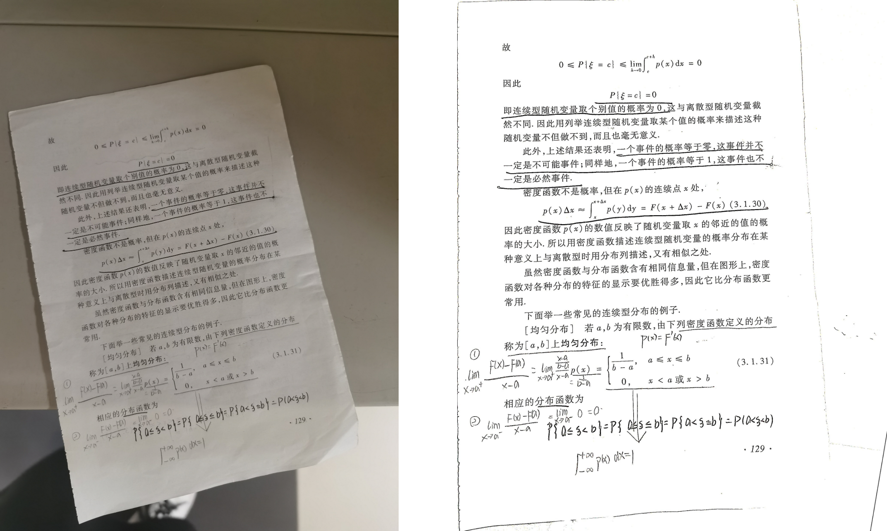
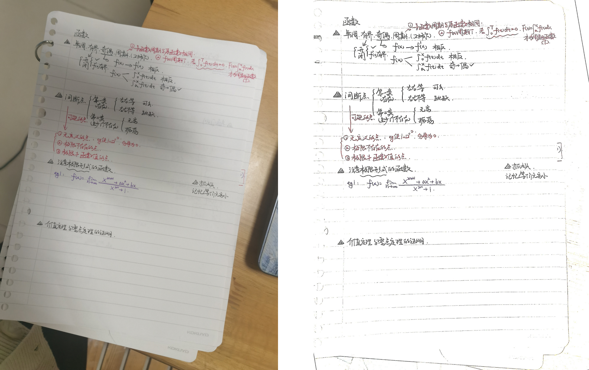
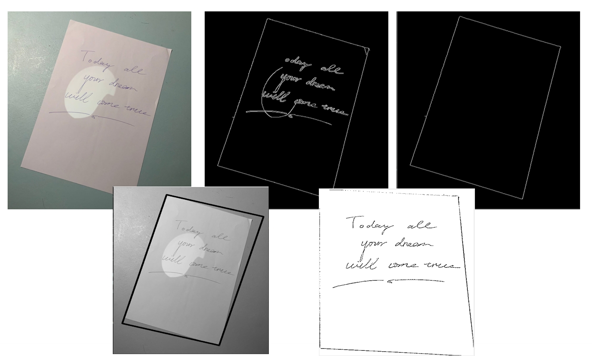

# Computer_Vision

> 计算机视觉课程的代码练习+期末展示（CamScanner.py）

experiment report : experimental reports

CamScanner.py：a study of the “CamScanner” application, the deployment was finally completed through the WeChat mini-program.

other *.py: Code practice

## Demonstration: 

Final visual presentation after deployment on WeChat Mini Program

## Method Description

### Image Correction Method 1

Targeting images containing substantial noise for contour detection

* **Step 1: Image Contour Extraction** 

> Extract image contours using the Canny algorithm, with Gaussian filtering and dilation preprocessing applied to enhance edge information.

* **Step 2: Maximum Contour Extraction**

> Identify the contour with the largest area in the image as the target information region, filtering out numerous interfering contours.

* **Step 3: Perspective Transformation**

> After obtaining the maximum contour, identify its four vertices and perform perspective transformation to achieve image rectification.

### Image Correction Method 2

