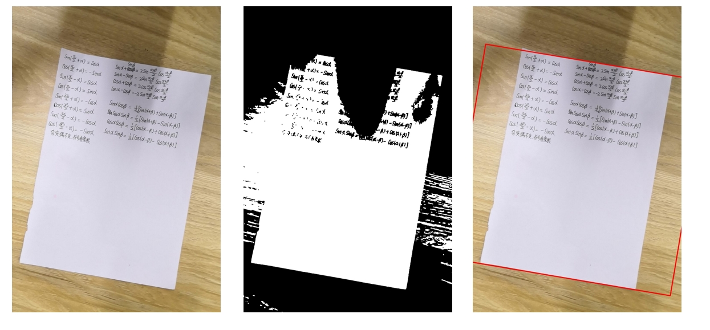
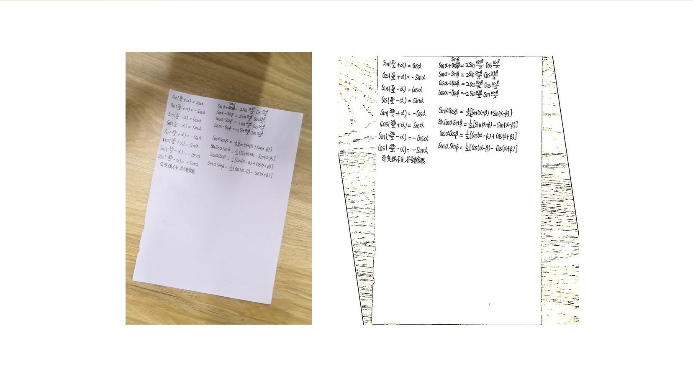

# Computer_Vision

> 计算机视觉课程的代码练习+期末展示（CamScanner.py）

experiment report : experimental reports

CamScanner.py：a study of the “CamScanner” application

other *.py: Code practice

## Demonstration: 

Final visual presentation after deployment on WeChat Mini Program

   

## Method Description

### Image Correction Method 1

Targeting images containing substantial noise for contour detection

> * **Step 1: Image Contour Extraction**    
> Extract image contours using the Canny algorithm, with Gaussian filtering and dilation preprocessing applied to enhance edge information.    
> * **Step 2: Maximum Contour Extraction**    
> Identify the contour with the largest area in the image as the target information region, filtering out numerous interfering contours.    
> * **Step 3: Perspective Transformation**    
> After obtaining the maximum contour, identify its four vertices and perform perspective transformation to achieve image rectification.

### Image Correction Method 2

Targeting images with lighting interference artifacts

> 1. Read Grayscale Image： Load input image in grayscale mode    
> 2. Gaussian Filtering： Apply Gaussian blur for noise reduction    
> 3. Otsu's Thresholding： Perform automatic threshold segmentation using Otsu's method    
> 4. Morphological Operations： Execute closing followed by opening operations    
> 5. Vertex Acquisition： Detect and extract image corner points    
> 6. Rotation Correction： Apply geometric transformation for orientation normalization    

